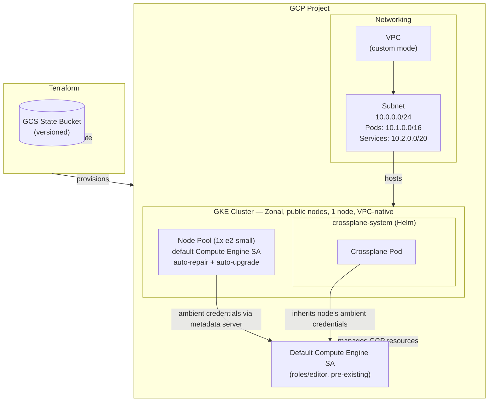

# Crossplane Multi-Cloud Control Planes

This repo has two independent Crossplane setups, provisioning infrastructure on two
different clouds from two different Kubernetes clusters:

| | Cluster | Cloud | Docs |
|---|---|---|---|
| **AWS** | An existing rke2 cluster (`kubectl config current-context` → `default`) | AWS EC2/VPC | [`crossplane_aws_setup.md`](crossplane_aws_setup.md) |
| **GCP** | A GKE cluster provisioned by [`terraform/`](terraform/) (this README) | GCP Compute Engine, GKE | [`crossplane_gcp_setup.md`](crossplane_gcp_setup.md), [`crossplane_gke_cluster_setup.md`](crossplane_gke_cluster_setup.md) |

Manifests referenced by those docs: `ec2-instances-crossplane.yaml` (AWS),
`gce-instances-crossplane.yaml` (GCP Compute), `gke-cluster-crossplane.yaml` (a
second, Crossplane-managed GKE cluster).

The rest of this README covers just the `terraform/` piece: bootstrapping the GKE
cluster that hosts the GCP-side Crossplane control plane.

---

## Architecture



> **No Workload Identity / dedicated service accounts by default.** This
> configuration was built and tested against a locked-down training-sandbox project
> where `setIamPolicy` was denied for every available identity — no IAM binding of
> any kind (including Workload Identity) could be created. Instead, GKE nodes (and
> everything running on them) authenticate to GCP as the **project's default Compute
> Engine service account** via the metadata server, which such sandboxes typically
> pre-grant `roles/editor`. That's broader-privileged than a real deployment should
> use. If you're running this against a project where you *can* grant IAM roles,
> restore the least-privilege design: a dedicated `google_service_account` per
> Crossplane provider, a `roles/iam.workloadIdentityUser` binding per SA, and
> `workload_identity_config` on the cluster + `workload_metadata_config { mode =
> "GKE_METADATA" }` on the node pool. See `crossplane_gcp_setup.md`'s and
> `crossplane_gke_cluster_setup.md`'s "why a separate SA" notes for the rationale,
> and the comments at the top of `terraform/iam.tf` for exactly what was removed.

### Key design decisions

| Decision | Rationale |
|---|---|
| Public nodes, no Cloud NAT | Cloud NAT has no free tier (hourly + per-GB billing regardless of usage); public nodes trade away that defense-in-depth layer to avoid a guaranteed recurring cost |
| Zonal cluster, 1 node, no autoscaling | Kept to the minimum node footprint — GKE node compute bills beyond the account's single free-tier e2-micro allowance regardless of machine type or count |
| VPC-native (alias IPs) | Required for Private Google Access and better network performance |
| Ambient node credentials, not Workload Identity | This sandbox project blocks all `setIamPolicy` calls — see the callout above |
| Separate node pool | Allows independent scaling and config from the GKE control plane |
| Isolated Helm repo config (`crossplane.tf`) | The Helm provider's SDK errors out if *any* repo in your global `~/.config/helm/repositories.yaml` lacks a cached index — even unrelated ones. `terraform/.helm/` sidesteps your machine's shared Helm config entirely |

---

## Prerequisites

- [Terraform](https://developer.hashicorp.com/terraform/downloads) >= 1.5
- [gcloud CLI](https://cloud.google.com/sdk/docs/install) authenticated as an identity
  with real IAM permissions on the target project (`gcloud auth
  application-default login`) — a service account key with no roles bound won't work,
  and in a locked-down sandbox, neither may your own user account for granting IAM
  roles. Verify with `gcloud projects get-iam-policy <PROJECT_ID>` before starting.
- A GCP project with the following APIs enabled:
  ```bash
  gcloud services enable \
    cloudresourcemanager.googleapis.com \
    container.googleapis.com \
    compute.googleapis.com \
    iam.googleapis.com \
    storage.googleapis.com \
    --project=<PROJECT_ID>
  ```

---

## Project structure

```
terraform/
├── versions.tf               # Provider + Terraform version pins
├── backend.tf                # GCS remote state backend
├── main.tf                   # google + google-beta provider config
├── variables.tf              # All input variables
├── vpc.tf                    # VPC, subnet, Cloud Router, Cloud NAT
├── gke.tf                    # GKE cluster + node pool
├── iam.tf                    # GCS state bucket (see the Workload Identity callout above)
├── crossplane.tf             # Helm + Kubernetes providers (isolated repo config), Crossplane Helm release
├── outputs.tf                # Cluster endpoint, kubeconfig command
├── terraform.tfvars.example  # Variable template — copy and fill in
└── .gitignore                # Excludes terraform.tfvars, *.tfstate, .helm/, .terraform/
```

---

## Usage

### 1. Create the GCS state bucket (one-time bootstrap)

The state bucket is managed by Terraform itself, but you need a temporary local backend for the first apply:

```bash
cd terraform

# Comment out the backend block in backend.tf, then:
terraform init
terraform apply -target=google_storage_bucket.terraform_state

# Uncomment the backend block in backend.tf, set the bucket name, then migrate:
terraform init -migrate-state
```

### 2. Configure variables

```bash
cp terraform.tfvars.example terraform.tfvars
# Edit terraform.tfvars — set project_id and terraform_state_bucket at minimum
```

If your project has org-policy machine-type restrictions (common in training
sandboxes — check for a `customConstraints/custom.machineTypeWhitelist`-style policy
if `google_container_node_pool` creation fails with a generic `ERROR` state), set
`machine_type` to whatever's actually allowed. This config defaults to `e2-small`
(smallest machine type that reliably runs GKE system pods + Crossplane) to minimize
cost — it's still billed, since only `e2-micro` falls under GCP's always-free
allowance and GKE nodes need more headroom than that in practice. If your sandbox
whitelists a specific type instead (e.g. `e2-medium`, GKE's own default), use that.

### 3. Plan and apply

```bash
terraform plan
terraform apply
```

GKE cluster + node pool creation typically takes 5-15 minutes.
`google_container_node_pool` deletes/replacements can occasionally exceed
Terraform's internal wait timeout even when the underlying GCP operation is still
progressing normally — if `terraform apply` errors with a wait timeout, check
`gcloud container operations list --project=<PROJECT_ID>` before assuming something's
actually broken; the operation is often still `RUNNING` and will finish on its own.

### 4. Configure kubectl

```bash
# The exact command is in Terraform outputs:
terraform output -raw kubeconfig_command | bash

# Verify Crossplane is running:
kubectl get pods -n crossplane-system
```

### 5. Install a Crossplane provider (example: GCP Compute)

```bash
kubectl apply -f - <<EOF
apiVersion: pkg.crossplane.io/v1
kind: Provider
metadata:
  name: provider-family-gcp
spec:
  package: xpkg.upbound.io/upbound/provider-family-gcp:v3.0.0
---
apiVersion: pkg.crossplane.io/v1
kind: Provider
metadata:
  name: provider-gcp-compute
spec:
  package: xpkg.upbound.io/upbound/provider-gcp-compute:v3.0.0
EOF
```

Then a `ProviderConfig` with `credentials.source: InjectedIdentity` (ambient node
credentials — see the Workload Identity callout above) or `Secret` (a key file, if
running from a non-GCP cluster like the rke2 one). Full walkthrough, including a
`provider-gcp-container:v3.0.0` bug we hit (it panics if `NodePool`'s `nodeConfig`
block is set at all — omit it entirely and let GKE default the machine type) in
[`crossplane_gcp_setup.md`](crossplane_gcp_setup.md) and
[`crossplane_gke_cluster_setup.md`](crossplane_gke_cluster_setup.md).

---

## Variables

| Name | Description | Default |
|---|---|---|
| `project_id` | GCP project ID | — (required) |
| `region` | GCP region (used for the state bucket) | `us-central1` |
| `zone` | GCP zone for the zonal GKE cluster | `us-central1-a` |
| `cluster_name` | GKE cluster name | `crossplane-control-plane` |
| `environment` | Environment label on nodes | `prod` |
| `min_node_count` | Node pool size, fixed at 1 (no autoscaling) | `1` |
| `machine_type` | Node machine type | `e2-small` |
| `subnet_cidr` | Primary subnet CIDR | `10.0.0.0/24` |
| `pods_cidr` | Secondary range for pods | `10.1.0.0/16` |
| `services_cidr` | Secondary range for services | `10.2.0.0/20` |
| `master_cidr` | GKE master CIDR (`/28`) | `172.16.0.0/28` |
| `crossplane_version` | Crossplane Helm chart version | `1.17.1` |
| `terraform_state_bucket` | GCS bucket name for state | — (required) |

---

## Outputs

| Name | Description |
|---|---|
| `cluster_name` | GKE cluster name |
| `cluster_endpoint` | Cluster API endpoint (sensitive) |
| `cluster_ca_certificate` | Cluster CA cert base64 (sensitive) |
| `terraform_state_bucket` | State bucket name |
| `kubeconfig_command` | `gcloud` command to configure kubectl |

---

## Destroy

```bash
terraform destroy
```

> The GCS state bucket has `force_destroy = false`. Delete its contents manually before destroying if Terraform complains.

If your GCP project is itself ephemeral (a training sandbox with a time limit), the
platform may delete the whole project out from under you — `terraform destroy` (and
any `gcloud`/`kubectl` command) will then fail with something like `Project #...
has been deleted`. That's the platform reclaiming everything for you; no manual
cleanup is needed or possible at that point.
